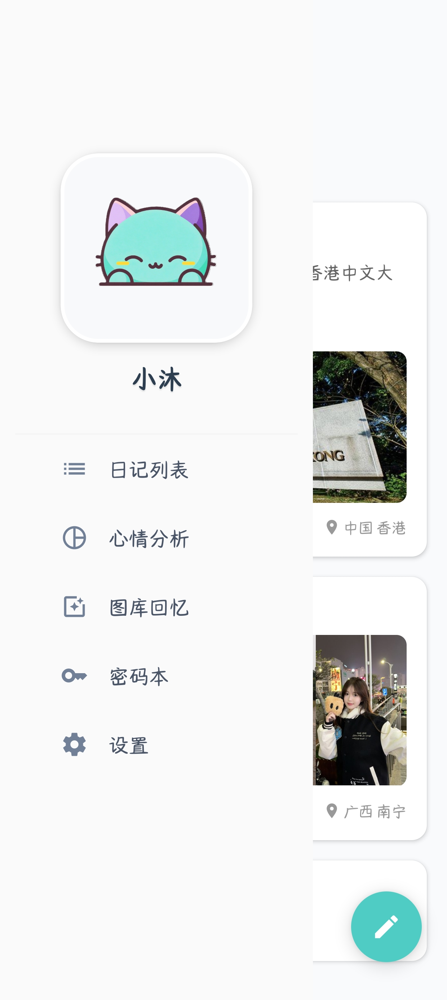
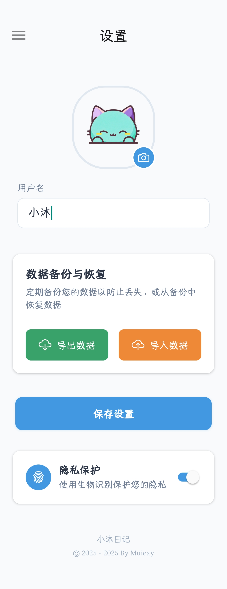
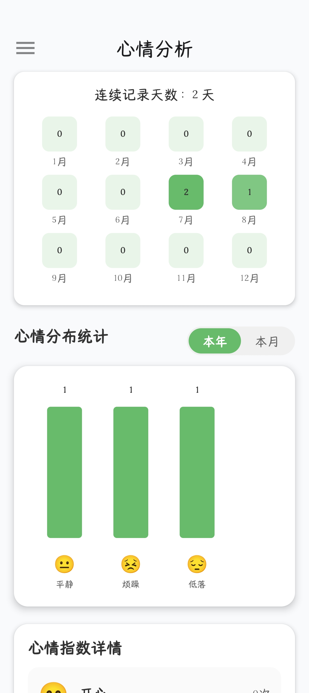
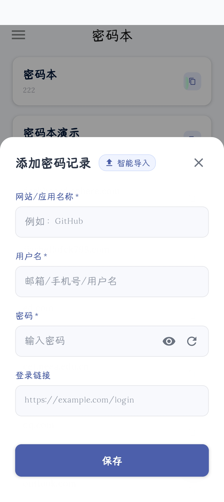
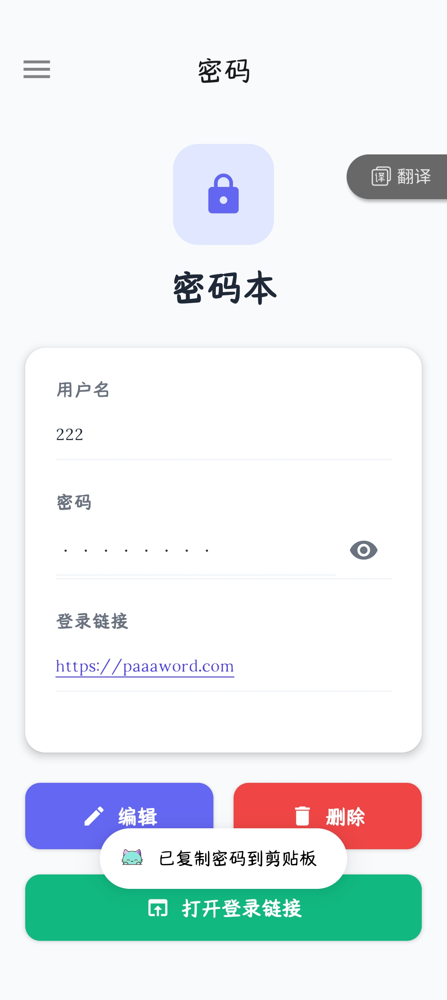

# 小沐日记
**日记管理 ：**创建、编辑、查看和删除日记条目，丰富内容支持 ：文本、天气、心情、照片、视频、位置和标签； 

**媒体管理 ：**照片和视频的拍摄、选择与预览，优化的存储策略； 

**心情分析 ：**基于日记内容的情绪变化趋势分析；

**密码本：**存储各种网站账号密码，完全本地化，生物识别认证保障数据安全。

**数据安全：**采用混合存储策略，深度优化数据存储；自研数据加密算法结合生物识别认证保障数据安全。

##### 页面展示：

